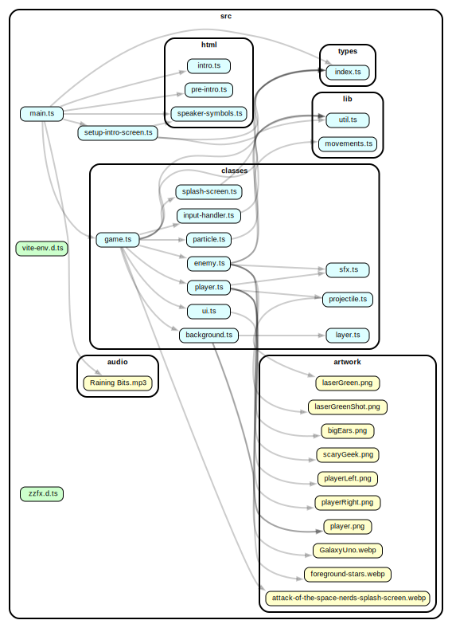

# Attack of the Space Nerds

2D space shooter made in vanilla JS/TypeScript and HTML canvas. Parallax scrolling.

**You can try current version of the game by pressing [this link](https://attack-of-the-space-nerds.netlify.app/)**

I made this to practice building a game from scratch without any game engines, and also to practice working with classes in JS.

I chose to make everything in TypeScript to learn some new concepts and to practice my coding skills. Most of my hobby projects are made because I want to learn something new, or practice a language or a framework.

The game works best on desktop computers, I'm planning to add some better touch controls for mobile phones.

## How the game is built

- `./src/main.ts` Initializes the game, the intro screens, sound etc. Starts the game animation loop which is called on every frame using requestAnimationFrame().
- `./src/classes/game.ts` The main `Game` class that keeps track of everything (player, enemies, bullets, score, lives, etc.). All other classes are instantiated from the `Game` class. For instance: in the constructor of the `Game` class we have `this.player = new Player(this)`, and in the `Player` class we have everytning concerning the player ship (space ship image, update and draw methods, etc).
- Most of the classes have a `draw()` or `render()` method for drawing graphics to the HTML canvas. Runs on every frame.
- Most of the classes also have an `update` method that runs on every frame. The update methods contains the "business logic", like updating the x and y positions of enemies and players, making the player shoot bullets, etc.
- We're running the update and render methods of the Game class from `./src/main.ts`. Then the update and render methods of the other classes (enemies, players, projectiles, ui, background etc.) are called from the `Game` class' update method. In that way, we keep most of the game logic inside the Game class.
- The update method of the `Game` class takes care of adding enemies to the game by instantiating a new `Enemy` and pushing it to an array `enemyWave: Enemy[]`. The `Game` class also have methods for collision detection, which we also run from the `Game` class' update method.
- All enemies have a given number of lives (stored as a field on the class). When an enemy is hit, we subtract 1. If we reach 0, we mark the enemy for deletion so that we can remove the enemy from the screen on the next update. After a nice explosion, of course.

### Particle effects

For the explisions, I made some quite nice particle effects.

I made a ´Particle´ class that takes the Game object and a x and y position as parameters. When for instance an enemy is hit, we can instantiate a new particle - or a bunch of particles - at the exact position of the enemy. Each particle has a random color, size and direction.

All the particles on the canvas is stored in a field on the `Game` class: `particles: Particle[]`. In the `Game` class (update method) we loop over the particles array and run the Particle.update method on each particle to move the particles, and then in the `Game` class render method we run the Particle.draw method to draw the particles on the screen.

When the particles moves off the screen, we mark them for deletion and remove them from the particles array on the Game class on the next update cycle.

## Future improvements

The game still needs a lot of work. It should probably be more difficult, by adding more enemies and a lot more action. And the enemy ship controls should work better on mobile screens. I've only added some rudimentary touch controls.

Resizing of the browser window during game play does not work, I need to fix this.

---

**You can try current version of the game by pressing [this link](https://attack-of-the-space-nerds.netlify.app/)**

---

## Credits

Title screen graphics made by DALL-E.

Some game graphics from opengameart.org. Enemies and enemy animations are made by me with DALL-E (AI generated images) and Figma.

Space Shooter graphics by Kenney Vleugels (www.kenney.nl)

Sound effects made with [ZzFX (Zuper Zmall Zound Zynth) by Frank Force](https://killedbyapixel.github.io/ZzFX/)

Some ideas and code from this great tutorial: [Code a 2D Game Using JavaScript, HTML, and CSS](https://youtu.be/7BHs1BzA4fs)

---

## Here's a graphical representation of the game

Made with [Dependency Cruiser](https://www.npmjs.com/package/dependency-cruiser)

